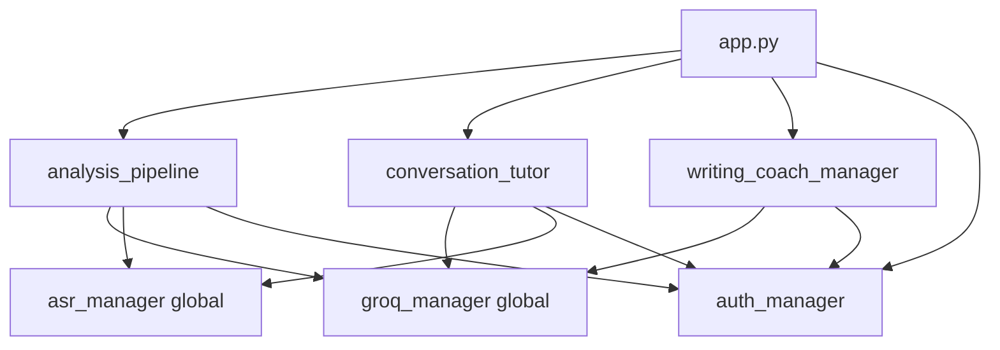

# 🏗️ Análisis Arquitectónico: De Monolito a Arquitectura Modular

**Proyecto**: Accent Coach AI
**Análisis basado en**: Microservices Patterns (Chris Richardson) - Pilar 1
**Fecha**: 2025-12-02
**Estado actual**: Monolito con síntomas de Monolithic Hell

---

## 📑 Tabla de Contenidos

1. [Identificación del Monolithic Hell](#1️⃣-identificación-del-monolithic-hell)
2. [Dominios Funcionales (DDD)](#2️⃣-identificación-de-dominios-funcionales-ddd)
3. [Dependencias Circulares y God Objects](#3️⃣-dependencias-circulares-y-god-objects)
4. [Estrategia de Descomposición](#4️⃣-estrategia-de-descomposición)
5. [Roadmap de Refactorización](#5️⃣-roadmap-de-refactorización)
6. [Diagnóstico Final](#6️⃣-diagnóstico-final)

---

## 1️⃣ IDENTIFICACIÓN DEL MONOLITHIC HELL

### 🔴 Síntomas Presentes en el Código

Analizando `app.py` (1,295 líneas) y la estructura de archivos, se detectan los siguientes síntomas claros de **Monolithic Hell**:

#### **A. God Class: `app.py` (1,295 líneas)**

**Responsabilidades mezcladas**:
- UI rendering (Streamlit components)
- Lógica de negocio (analysis orchestration)
- Orquestación de servicios
- Gestión de persistencia
- Manejo de estado de sesión

**Maneja 4 dominios completamente diferentes**:
1. Pronunciation Practice (líneas 986-1278)
2. Conversation Tutor (líneas 217-429)
3. Writing Coach (líneas 431-664)
4. Language Assistant (líneas 666-748)

**Inicializa y coordina 10+ managers diferentes**:
```python
# Líneas 771-782
analysis_pipeline = AnalysisPipeline(asr_manager, groq_manager, ...)
writing_coach_manager = WritingCoachManager(groq_manager)
language_query_manager = LanguageQueryManager(groq_manager)
conversation_tutor = ConversationTutor(groq_manager, asr_manager, ...)
```

#### **B. Acoplamiento Fuerte**

**Singleton globals compartidos**:
```python
# Líneas 75-78
asr_manager = ASRModelManager(DEFAULT_MODEL, MODEL_OPTIONS)
auth_manager = AuthManager(st.secrets if hasattr(st, 'secrets') else None)
groq_manager = GroqManager()
```

**Problemas**:
- Todos los managers dependen de instancias globales
- Imposible testear en aislamiento
- Cambiar un manager afecta múltiples flujos
- No hay dependency injection

#### **C. Shared Database Pattern (Anti-pattern)**

`auth_manager` maneja persistencia para TODOS los dominios:
```python
auth_manager.save_analysis_to_firestore()           # Pronunciation
auth_manager.save_writing_analysis_to_firestore()   # Writing
auth_manager.save_language_query()                  # Language Query
auth_manager.log_activity()                         # Activity Tracking
auth_manager.get_today_activities()                 # Analytics
```

**Problemas**:
- Un solo manager accede a todos los datos
- Dominios diferentes comparten el mismo esquema
- Imposible escalar independientemente
- Cambiar a PostgreSQL requiere modificar todos los dominios

#### **D. Problemas de Escalabilidad**

| Componente | Problema | Impacto |
|------------|----------|---------|
| **ASR Model** | Cargado globalmente (línea 75) | Consume RAM incluso para Writing Coach |
| **Groq Manager** | Compartido por todos los dominios | Rate limits afectan todos los flujos |
| **Session State** | En memoria (st.session_state) | No soporta múltiples instancias/pods |
| **Audio Processing** | Sincrónico | Bloquea UI durante transcripción (5-10s) |

#### **E. Dependencias Circulares Implícitas**



**Problema**: Todos los componentes comparten las mismas instancias globales.

#### **F. Deployment Hell**

**Síntomas**:
- ❌ Un único `requirements.txt` → Cambios en cualquier feature requieren redeploy total
- ❌ Imposible escalar por feature → Conversation Tutor podría necesitar 4GB RAM, Writing Coach solo 512MB
- ❌ Testing bloqueado → No puedes testear Writing Coach sin cargar el modelo ASR (1.2GB)
- ❌ Deploy lento → Cualquier cambio requiere rebuild completo (10+ minutos)

---

## 2️⃣ IDENTIFICACIÓN DE DOMINIOS FUNCIONALES (DDD)

Basándome en el análisis del código, identifico **9 Bounded Contexts** claros:

### **BC1: Audio Processing & Enhancement**

#### **Qué hace**:
- Captura y valida audio
- Mejora calidad (denoising, VAD)
- Conversión de formatos
- Generación de TTS (Text-to-Speech)

#### **Datos que manipula**:
- `audio_bytes`: Raw audio input
- `waveform`: Array numpy de audio procesado
- `sample_rate`: Frecuencia de muestreo
- `AudioConfig`: Configuración de enhancement (VAD, denoising)

#### **Módulos actuales**:
- `audio_processor.py` → AudioProcessor
- `audio_enhancement.py` → Enhancement logic
- `AudioValidator` → Validación de calidad
- `TTSGenerator` → Text-to-Speech

#### **Límites naturales**:
- **Input**: Raw audio bytes
- **Output**: Processed audio array + metadata (sample_rate, duration)
- **No debe saber**: Qué se hará con el audio (ASR, análisis, almacenamiento)

#### **Responsabilidades mal ubicadas**:
- ⚠️ `TTSGenerator` usado directamente en 4 lugares diferentes (app.py, results_visualizer.py, conversation_tutor.py, writing_coach.py)
- ⚠️ Validación de calidad mezclada con procesamiento
- ⚠️ No hay abstracción para cambiar provider TTS (actualmente hardcoded a gTTS)

---

### **BC2: Speech Recognition & Transcription**

#### **Qué hace**:
- Carga y gestiona modelos ASR (Wav2Vec2)
- Transcribe audio a texto
- Gestiona cache de modelos
- Optimiza uso de GPU/CPU

#### **Datos que manipula**:
- Modelos Wav2Vec2 (facebook/wav2vec2-base-960h, etc.)
- Transcripciones + confidence scores
- Configuración de modelos (model_name, device)

#### **Módulos actuales**:
- `asr_model.py` → ASRModelManager

#### **Límites naturales**:
- **Input**: Audio procesado (ProcessedAudio)
- **Output**: Texto transcrito + confidence scores
- **No debe saber**: Si es para pronunciation practice, conversation o writing evaluation

#### **Responsabilidades mal ubicadas**:
- ⚠️ Usado directamente desde `app.py` como singleton global (línea 75)
- ⚠️ Cargado en memoria incluso cuando se usa Writing Coach (no necesita ASR)
- ⚠️ No hay abstracción para cambiar provider ASR (Google Speech, Whisper, etc.)

---

### **BC3: Phonetic Analysis & IPA**

#### **Qué hace**:
- Conversión texto → fonemas (G2P: Grapheme-to-Phoneme)
- Alineación fonética (Needleman-Wunsch algorithm)
- Cálculo de métricas de pronunciación
- Generación de guías IPA educativas
- Silabificación

#### **Datos que manipula**:
- Fonemas IPA (International Phonetic Alphabet)
- Diccionarios fonéticos (lexicons)
- Símbolos y definiciones IPA
- Sílabas
- Métricas: word_accuracy, phoneme_accuracy, error_rate
- Alignment data: substitutions, insertions, deletions

#### **Módulos actuales**:
- `phoneme_processor.py` → PhonemeProcessor
- `ipa_definitions.py` → IPADefinitionsManager
- `syllabifier.py` → Syllabifier
- `metrics_calculator.py` → MetricsCalculator
- Parte de `analysis_pipeline.py` (lógica de alineación)

#### **Límites naturales**:
- **Input**: Reference text + Recorded text
- **Output**: PronunciationAnalysis (alignment, metrics, breakdown, suggested_drills)
- **No debe saber**: Cómo se mostrará (UI), quién lo pidió (auth), dónde se guardará

#### **Responsabilidades mal ubicadas**:
- ⚠️ `ResultsVisualizer.render_ipa_guide()` (líneas 98-209) tiene lógica de negocio mezclada con UI
- ⚠️ Métricas calculadas en `metrics_calculator.py` pero también lógica duplicada en `analysis_pipeline.py`
- ⚠️ No hay separación clara entre "análisis fonético" y "guía educativa IPA"

---

### **BC4: Pronunciation Practice (Core Business)**

#### **Qué hace**:
- Orquesta flujo completo: estudio → grabación → análisis → feedback
- Gestiona sesión de práctica
- Drilling selectivo de palabras con errores
- Historial de intentos por sesión
- Generación de textos de práctica

#### **Datos que manipula**:
- Textos de práctica (PracticeTextManager)
- Resultados de análisis (PronunciationAnalysis)
- Progreso del usuario en sesión
- Palabras sugeridas para drilling (`suggested_drill_words`)
- Historial de análisis (`analysis_history`)

#### **Módulos actuales**:
- Gran parte de `app.py` (líneas 986-1278)
- `practice_texts.py` → PracticeTextManager
- `session_manager.py` (parcialmente)
- `analysis_pipeline.py` (orquestación)

#### **Límites naturales**:
- **Input**: User selection, audio recording, reference text
- **Output**: PracticeResult (analysis, feedback, suggested_drills, history)
- **Depende de**: BC2 (ASR), BC3 (Phonetic), BC6 (LLM Feedback)

#### **Responsabilidades mal ubicadas**:
- ❌ TODO está en `app.py` mezclado con UI de Streamlit
- ❌ No hay separación entre lógica de negocio y presentación
- ❌ Orquestación dispersa entre `app.py` y `analysis_pipeline.py`
- ❌ Estado de sesión manejado con `st.session_state` (no testeable)

---

### **BC5: Conversation Tutoring**

#### **Qué hace**:
- Gestiona sesiones de conversación (topics, levels)
- Genera follow-up questions contextuales
- Evalúa respuestas del usuario (grammar, fluency)
- Feedback en tiempo real (practice mode) vs al final (exam mode)
- Tracking de progreso conversacional

#### **Datos que manipula**:
- `ConversationSession` (session_id, topic, user_id, turns)
- Historia de turnos conversacionales
- Transcripciones de usuario
- Correcciones y mejoras sugeridas
- Follow-up questions + audio

#### **Módulos actuales**:
- `conversation_tutor.py` → ConversationTutor
- `conversation_manager.py` → ConversationManager
- `prompt_templates.py` → ConversationPromptTemplate, ConversationStarters
- Parte de `app.py` (líneas 217-429) → render_conversation_tutor()

#### **Límites naturales**:
- **Input**: Audio del usuario, historia conversacional, level, mode
- **Output**: TurnResult (feedback, correction, follow_up_question, audio_response)
- **Depende de**: BC2 (ASR), BC6 (LLM), BC1 (TTS para respuestas)

#### **Responsabilidades mal ubicadas**:
- ⚠️ `ConversationManager` hace persistencia directa a Firestore (líneas 336-341)
- ⚠️ UI mezclada con lógica en `render_conversation_tutor()`
- ⚠️ `ResultsVisualizer.render_conversation_history()` mezcla presentación con lógica

---

### **BC6: LLM Orchestration & Feedback**

#### **Qué hace**:
- Gestiona llamadas a Groq/LLM
- Genera feedback personalizado por dominio:
  - Pronunciation: coaching sobre errores fonéticos
  - Conversation: correcciones gramaticales + follow-ups
  - Writing: mejoras CEFR + vocabulario expandido
  - Language Query: explicaciones de idioms/phrasal verbs
- Rate limiting y retry logic
- Configuración de modelos (llama-3.1, gpt-4o-mini)

#### **Datos que manipula**:
- API keys (Groq, OpenAI)
- Prompt templates (diferentes por dominio)
- LLM responses
- Configuración: model, temperature, max_tokens

#### **Módulos actuales**:
- `groq_manager.py` → GroqManager
- `llm_feedback.py` → LLM prompt generation
- `prompt_templates.py` → Templates específicos

#### **Límites naturales**:
- **Input**: Contexto + prompt template + config
- **Output**: LLMResponse (text, tokens_used, cost)
- **No debe saber**: Quién lo usa (conversation, writing, pronunciation)

#### **Responsabilidades mal ubicadas**:
- ❌ `groq_manager` usado como singleton global (línea 81)
- ❌ Todos los dominios comparten la misma instancia → rate limits afectan a todos
- ❌ No hay abstracción para cambiar proveedor LLM (hardcoded a Groq)
- ❌ `prompt_templates.py` debería estar separado por dominio

---

### **BC7: Writing Evaluation**

#### **Qué hace**:
- Evalúa textos escritos (interview answers)
- Genera versiones mejoradas (polished version)
- Calcula métricas CEFR (A2, B1-B2, C1-C2)
- Sugiere vocabulario expandido
- Genera preguntas de follow-up
- Gestión de batches de preguntas

#### **Datos que manipula**:
- Textos escritos por usuario
- Preguntas de entrevista (TOPICS dict)
- Métricas de escritura: CEFR level, variety_score
- Correcciones y mejoras
- Vocabulario expandido: word, IPA, replaces_simple_word, meaning_context

#### **Módulos actuales**:
- `writing_coach_manager.py` → WritingCoachManager
- Parte de `app.py` (líneas 431-664) → render_writing_coach()

#### **Límites naturales**:
- **Input**: Written text, selected questions, user_id
- **Output**: WritingEvaluation (corrected, metrics, improvements, questions, expansion_words)
- **Depende de**: BC6 (LLM), BC1 (TTS para polished version)

#### **Responsabilidades mal ubicadas**:
- ⚠️ UI mezclada con lógica en `render_writing_coach()`
- ⚠️ Persistencia acoplada a `auth_manager` (línea 646)
- ⚠️ XP calculation mezclada con lógica de evaluación

---

### **BC8: User Management & Activity Tracking** *(Soporte)*

#### **Qué hace**:
- Autenticación Firebase (login, register)
- Gestión de sesiones de usuario
- Tracking de actividades (pronunciation, conversation, writing)
- Cálculo de progreso diario (daily goals)
- Analytics de uso

#### **Datos que manipula**:
- User credentials (email, password, localId)
- Activity logs (timestamp, activity_type, score, metadata)
- Daily goals (accumulated_score, progress_percentage)
- Session state (current_result, conversation_session, writing_result)

#### **Módulos actuales**:
- `auth_manager.py` → AuthManager
- `session_manager.py` → SessionManager
- `activity_logger.py` → ActivityLogger

#### **Límites naturales**:
- **Input**: User actions desde cualquier BC
- **Output**: User data, activity records, analytics
- **No debe saber**: Detalles de negocio de cada BC (phonetic algorithms, LLM prompts, etc.)

#### **Responsabilidades mal ubicadas**:
- ❌ `auth_manager` hace TODO (violación extrema de SRP):
  - Firebase authentication
  - Firestore persistence para 4 dominios diferentes
  - Activity logging
  - Analytics
  - User registration tracking
- ❌ Debería dividirse en:
  - `AuthService` (authentication only)
  - `ActivityRepository` (activity tracking)
  - `AnalysisRepository` (pronunciation results)
  - `ConversationRepository` (conversation turns)
  - `WritingRepository` (writing evaluations)

---

### **BC9: Language Query Assistant**

#### **Qué hace**:
- Responde preguntas sobre idioma inglés
- Chat conversacional text-based
- Explicaciones de:
  - Idioms ("beat around the bush")
  - Phrasal verbs ("get over", "put up with")
  - Grammar ("when to use present perfect?")
  - Vocabulary ("difference between 'affect' and 'effect'?")

#### **Datos que manipula**:
- Chat history (list of {user_query, llm_response})
- Queries del usuario
- Respuestas del LLM

#### **Módulos actuales**:
- `language_query_manager.py` → LanguageQueryManager
- Parte de `app.py` (líneas 666-748) → render_language_chat()

#### **Límites naturales**:
- **Input**: User query, conversation history
- **Output**: LLM response (explanation)
- **Depende de**: BC6 (LLM)

#### **Responsabilidades mal ubicadas**:
- ⚠️ Persistencia mezclada con lógica (línea 731: `auth_manager.save_language_query()`)
- ⚠️ UI mezclada con lógica en `render_language_chat()`

---

### 📊 **Resumen de Bounded Contexts**

| BC | Nombre | Estado | Complejidad | Prioridad Refactor |
|----|--------|--------|-------------|-------------------|
| BC1 | Audio Processing | ✅ Relativamente aislado | Media | 🟡 Baja |
| BC2 | Speech Recognition | ⚠️ Singleton global | Alta | 🟠 Media |
| BC3 | Phonetic Analysis | ⚠️ Disperso en 4 archivos | Alta | 🔴 Alta |
| BC4 | Pronunciation Practice | ❌ Mezclado en app.py | Alta | 🔴 Alta |
| BC5 | Conversation Tutor | ⚠️ Lógica + UI mezclada | Media | 🟠 Media |
| BC6 | LLM Orchestration | ❌ Singleton compartido | Alta | 🔴 Alta |
| BC7 | Writing Coach | ⚠️ Lógica + UI mezclada | Media | 🟡 Baja |
| BC8 | User Management | ❌ God object | Alta | 🔴 Alta |
| BC9 | Language Query | ⚠️ Lógica + UI mezclada | Baja | 🟡 Baja |

---

## 3️⃣ DEPENDENCIAS CIRCULARES Y GOD OBJECTS

### 🔴 **God Objects Detectados**

#### **1. `auth_manager.py` - The Mega Repository**

**Hace DEMASIADO**:
```python
# Authentication
- login_user(email, password)
- register_user(email, password)
- save_user_registration()

# Firestore persistence para 4 dominios diferentes:
- save_analysis_to_firestore()           # BC4: Pronunciation
- save_writing_analysis_to_firestore()   # BC7: Writing
- save_language_query()                  # BC9: Language Query
- (implícito) save_conversation_turn()   # BC5: Conversation

# Activity logging
- log_activity(activity_log)

# Analytics
- get_today_activities(user_id)
- get_user_analyses(user_id)
```

**Violaciones**:
- ❌ Single Responsibility Principle
- ❌ Interface Segregation Principle
- ❌ Shared Database Anti-pattern

**Impacto**:
- Cambiar esquema de Firestore requiere modificar 1 archivo gigante
- Testing requiere mock de Firebase para TODOS los tests
- Imposible escalar persistencia por dominio

---

#### **2. `app.py` - The Orchestrator from Hell**

**Estadísticas**:
- 📏 1,295 líneas
- 🎯 4 dominios completamente diferentes (tabs)
- 🔧 Inicializa 10+ managers
- 🎨 Mezcla UI + lógica + orquestación + persistencia

**Responsabilidades**:
```python
# UI Rendering (Streamlit)
- render_conversation_tutor()
- render_writing_coach()
- render_language_chat()
- main() tab management

# Business Logic
- Analyze pronunciation (líneas 1110-1168)
- Auto-select drill words (líneas 1155-1166)
- Calculate metrics

# Orchestration
- Initialize all managers (líneas 771-782)
- Load ASR model (líneas 1113-1119)
- Save to database

# Session Management
- st.session_state management
- History tracking
```

**Impacto**:
- ❌ Imposible testear
- ❌ Difícil de leer y mantener
- ❌ Cambios en un tab pueden romper otros
- ❌ Onboarding de nuevos desarrolladores: 2+ semanas

---

#### **3. `analysis_pipeline.py` - Probable Over-Orchestrator**

Sin ver el contenido completo, basándome en su uso (líneas 1125-1131), sospecho:

```python
# Probablemente hace:
- Audio processing
- ASR transcription
- Phoneme generation
- Alignment
- Metrics calculation
- LLM feedback generation
- Result formatting
```

**Sospecha**: Orquesta demasiado, mezcla responsabilidades de BC1, BC2, BC3, BC4.

---

### 🔗 **Dependencias Circulares y Acoplamiento Peligroso**

#### **Cluster 1: Groq Manager Singleton**

```python
# Todos comparten la misma instancia global:
conversation_tutor → groq_manager (global)
writing_coach_manager → groq_manager (global)
language_query_manager → groq_manager (global)
analysis_pipeline → groq_manager (global)
```

**Problemas**:
- ❌ Rate limits de Groq afectan a TODOS los dominios
- ❌ Imposible configurar diferente por dominio (ej: temperature=0.0 para Writing, 0.7 para Conversation)
- ❌ Testing requiere mock global compartido
- ❌ No se puede escalar LLM calls independientemente

**Ejemplo de bug real**:
```python
# User A usa Conversation Tutor → hace 10 LLM calls rápido
# User B intenta usar Writing Coach → recibe 429 Rate Limit Error
# Porque comparten el mismo groq_manager global
```

---

#### **Cluster 2: Audio + ASR Coupling**

```python
app.py → asr_manager (global, línea 75)
conversation_tutor → asr_manager (inyectado pero mismo singleton)
analysis_pipeline → asr_manager (inyectado pero mismo singleton)
```

**Problemas**:
- ❌ Modelo ASR (1.2GB) cargado en memoria incluso para Writing Coach (no usa ASR)
- ❌ No se puede escalar ASR independientemente
- ❌ Cambiar modelo ASR requiere reiniciar toda la app

**Desperdi de recursos**:
```
User solo usa Writing Coach:
- RAM consumida: 1.5GB (ASR model 1.2GB + app 300MB)
- RAM necesaria: 300MB
- Desperdicio: 1.2GB (80% de memoria desperdiciada)
```

---

#### **Cluster 3: UI + Business Logic Entanglement**

```python
# results_visualizer.py líneas 98-209
class ResultsVisualizer:
    @staticmethod
    def render_ipa_guide(...):
        selected_words = []  # ← ESTADO DE NEGOCIO

        with st.expander(...):  # ← UI
            for i, item in enumerate(breakdown_data):
                if st.checkbox(...):  # ← UI
                    selected_words.append(item['word'])  # ← BUSINESS LOGIC

                if item['word'] in selected_words:  # ← BUSINESS LOGIC
                    st.markdown(f"**🎯 {item['word']}**")  # ← UI
```

**Problemas**:
- ❌ Imposible testear lógica de selección sin Streamlit
- ❌ Imposible reutilizar lógica en CLI o API
- ❌ Violación de Separation of Concerns

---

#### **Cluster 4: Persistence Everywhere**

```python
# Persistencia dispersa en múltiples lugares:
app.py (línea 1136) → auth_manager.save_analysis_to_firestore()
app.py (línea 646) → auth_manager.save_writing_analysis_to_firestore()
app.py (línea 731) → auth_manager.save_language_query()
conversation_manager.py (línea 340) → Firestore directly
```

**Problemas**:
- ❌ No hay abstracción de persistencia
- ❌ Cambiar a PostgreSQL requiere tocar 10+ archivos
- ❌ Testing requiere Firebase emulator para TODO
- ❌ Imposible cachear o usar diferentes DBs por dominio

---

### ⚠️ **Módulos con Múltiples Roles**

#### **`session_manager.py`**

Probablemente hace (sin ver contenido completo):
```python
- render_login_ui() → UI rendering
- render_user_info_and_history() → UI rendering
- save_analysis() → Persistence
- get_user_analyses() → Data retrieval
- Session state management
```

**Debería dividirse en**:
- `SessionService` (business logic)
- `LoginUI` (presentation)
- `AnalysisHistoryUI` (presentation)

---

#### **`conversation_manager.py`**

Mezcla:
```python
- record_turn() → Business logic
- Firestore persistence (línea 340)
- export_session_to_text() → Export feature
- close_session() → Lifecycle management
```

**Debería dividirse en**:
- `ConversationService` (business logic)
- `ConversationRepository` (persistence)
- `ConversationExportService` (export)

---

### 📊 **Mapa de Dependencias Actuales (Problemático)**

```
                    ┌─────────────┐
                    │   app.py    │ (God Class)
                    └──────┬──────┘
                           │
        ┌──────────────────┼──────────────────┐
        ▼                  ▼                  ▼
┌───────────────┐  ┌───────────────┐  ┌───────────────┐
│ conversation  │  │ pronunciation │  │   writing     │
│    tutor      │  │   pipeline    │  │    coach      │
└───────┬───────┘  └───────┬───────┘  └───────┬───────┘
        │                  │                  │
        └──────────┬───────┴───────┬──────────┘
                   ▼               ▼
        ┌──────────────────┐  ┌──────────────────┐
        │  groq_manager    │  │  auth_manager    │
        │   (SINGLETON)    │  │   (GOD OBJECT)   │
        └──────────────────┘  └──────────────────┘
                   ▲
                   │ (shared by all)
        ┌──────────┴──────────┐
        │  asr_manager        │
        │  (SINGLETON)        │
        └─────────────────────┘
```

**Problema**: Todos los dominios convergen en 3 singletons compartidos.

---

## 4️⃣ ESTRATEGIA DE DESCOMPOSICIÓN

### 🗺️ **Mapa de Dominios Propuesto**

```
┌─────────────────────────────────────────────────────────────┐
│                    PRESENTATION LAYER                        │
│  (Streamlit UI - app.py refactored into thin controllers)   │
│                                                              │
│  - pronunciation_controller.py                               │
│  - conversation_controller.py                                │
│  - writing_controller.py                                     │
│  - language_query_controller.py                              │
└─────────────────────────────────────────────────────────────┘
                            │
        ┌───────────────────┼───────────────────┐
        ▼                   ▼                   ▼
┌───────────────┐  ┌───────────────┐  ┌───────────────┐
│ Pronunciation │  │ Conversation  │  │   Writing     │
│   Practice    │  │    Tutor      │  │   Coach       │
│   Service     │  │   Service     │  │   Service     │
│   (BC4)       │  │    (BC5)      │  │   (BC7)       │
└───────┬───────┘  └───────┬───────┘  └───────┬───────┘
        │                  │                   │
        └──────────┬───────┴───────┬───────────┘
                   ▼               ▼
        ┌──────────────────┐  ┌──────────────────┐
        │  Phonetic        │  │  LLM Service     │
        │  Analysis        │  │  (Abstraction)   │
        │  Service (BC3)   │  │  (BC6)           │
        └────────┬─────────┘  └──────────────────┘
                 │
        ┌────────┴─────────┐
        ▼                  ▼
┌──────────────┐    ┌──────────────┐
│ Transcription│    │ Audio        │
│ Service      │    │ Processing   │
│ (BC2)        │    │ Service      │
└──────────────┘    │ (BC1)        │
                    └──────────────┘

┌─────────────────────────────────────────────────────────────┐
│                  INFRASTRUCTURE LAYER                        │
│                                                              │
│  ┌─────────────┐  ┌─────────────┐  ┌─────────────┐         │
│  │ User        │  │ Repository  │  │ Activity    │         │
│  │ Management  │  │ Pattern     │  │ Tracking    │         │
│  │ (BC8)       │  │             │  │             │         │
│  └─────────────┘  └─────────────┘  └─────────────┘         │
│                                                              │
│  - PronunciationRepository                                   │
│  - ConversationRepository                                    │
│  - WritingRepository                                         │
│  - UserRepository                                            │
│  - ActivityRepository                                        │
└─────────────────────────────────────────────────────────────┘
```

---

### 📦 **Servicios Propuestos con Interfaces Claras**

#### **Service 1: Audio Processing Service**

```python
# domain/audio/service.py
from dataclasses import dataclass
from typing import Optional

@dataclass
class AudioConfig:
    enable_enhancement: bool = True
    enable_vad: bool = True
    enable_denoising: bool = True
    target_sample_rate: int = 16000

@dataclass
class ProcessedAudio:
    waveform: np.ndarray
    sample_rate: int
    duration: float
    quality_metrics: Optional[dict] = None

class AudioService:
    """BC1: Audio Processing & Enhancement

    Responsibilities:
    - Validate audio input
    - Enhance audio quality (denoising, VAD)
    - Convert audio formats
    - Generate TTS audio

    Dependencies: NONE (pure processing)
    """

    def __init__(self, processor: AudioProcessor, tts_generator: TTSGenerator):
        self._processor = processor
        self._tts = tts_generator

    def process_audio(self, audio_bytes: bytes, config: AudioConfig) -> ProcessedAudio:
        """
        Process raw audio for ASR consumption.

        Args:
            audio_bytes: Raw audio input
            config: Enhancement configuration

        Returns:
            ProcessedAudio with enhanced waveform

        Raises:
            AudioValidationError: If audio is invalid
        """
        # 1. Validate
        self._validate(audio_bytes)

        # 2. Load
        waveform, sr = self._processor.load_audio(audio_bytes)

        # 3. Enhance
        if config.enable_enhancement:
            waveform = self._enhance(waveform, sr, config)

        # 4. Resample
        if sr != config.target_sample_rate:
            waveform = self._processor.resample(waveform, sr, config.target_sample_rate)
            sr = config.target_sample_rate

        return ProcessedAudio(
            waveform=waveform,
            sample_rate=sr,
            duration=len(waveform) / sr
        )

    def generate_tts(self, text: str, lang: str = 'en-us') -> bytes:
        """
        Generate speech audio from text.

        Args:
            text: Text to convert to speech
            lang: Language code

        Returns:
            Audio bytes (MP3 format)
        """
        return self._tts.generate_audio(text, lang)
```

---

#### **Service 2: Transcription Service**

```python
# domain/transcription/service.py
from dataclasses import dataclass
from typing import Optional

@dataclass
class ASRConfig:
    model_name: str = "facebook/wav2vec2-base-960h"
    device: str = "cpu"  # or "cuda"
    use_lm: bool = False  # language model for better accuracy

@dataclass
class Transcription:
    text: str
    confidence: float
    word_timestamps: Optional[list] = None

class TranscriptionService:
    """BC2: Speech Recognition

    Responsibilities:
    - Transcribe audio to text
    - Manage ASR model lifecycle
    - Optimize GPU/CPU usage

    Dependencies:
    - Audio Service (through ProcessedAudio interface)
    """

    def __init__(self, asr_manager: ASRModelManager):
        self._asr = asr_manager

    def transcribe(
        self,
        audio: ProcessedAudio,
        config: ASRConfig
    ) -> Transcription:
        """
        Transcribe audio to text.

        Args:
            audio: Processed audio from AudioService
            config: ASR configuration

        Returns:
            Transcription with text and confidence

        Raises:
            TranscriptionError: If transcription fails
        """
        # Ensure model is loaded
        self._asr.load_model(config.model_name)

        # Transcribe
        result = self._asr.transcribe(audio.waveform, audio.sample_rate)

        return Transcription(
            text=result['text'],
            confidence=result.get('confidence', 1.0)
        )
```

---

#### **Service 3: Phonetic Analysis Service**

```python
# domain/phonetic/service.py
from dataclasses import dataclass
from typing import List, Dict

@dataclass
class PronunciationMetrics:
    word_accuracy: float
    phoneme_accuracy: float
    phoneme_error_rate: float
    correct_words: int
    total_words: int
    substitutions: int
    insertions: int
    deletions: int

@dataclass
class WordComparison:
    word: str
    ref_phonemes: str
    rec_phonemes: str
    match: bool
    phoneme_accuracy: float
    errors: List[str]

@dataclass
class IPABreakdown:
    index: int
    word: str
    ipa: str
    hint: str
    audio: Optional[bytes]

@dataclass
class PronunciationAnalysis:
    metrics: PronunciationMetrics
    per_word_comparison: List[WordComparison]
    ipa_breakdown: List[IPABreakdown]
    unique_symbols: set
    suggested_drill_words: List[str]

class PhoneticAnalysisService:
    """BC3: Phonetic Analysis & IPA

    Responsibilities:
    - Convert text to phonemes (G2P)
    - Align phonemes (Needleman-Wunsch)
    - Calculate pronunciation metrics
    - Generate IPA educational data
    - Suggest drill words based on errors

    Dependencies: NONE (pure logic)
    """

    def __init__(
        self,
        phoneme_processor: PhonemeProcessor,
        ipa_definitions: IPADefinitionsManager,
        syllabifier: Syllabifier,
        metrics_calculator: MetricsCalculator
    ):
        self._processor = phoneme_processor
        self._ipa_defs = ipa_definitions
        self._syllabifier = syllabifier
        self._metrics = metrics_calculator

    def analyze_pronunciation(
        self,
        reference_text: str,
        recorded_text: str,
        lang: str = 'en-us'
    ) -> PronunciationAnalysis:
        """
        Analyze pronunciation quality.

        Args:
            reference_text: Expected text
            recorded_text: What was actually said (from ASR)
            lang: Language code

        Returns:
            Complete pronunciation analysis
        """
        # 1. Generate phonemes
        ref_phonemes = self._processor.generate_reference_phonemes(
            reference_text, lang
        )
        rec_phonemes = self._processor.generate_reference_phonemes(
            recorded_text, lang
        )

        # 2. Align
        alignment = self._processor.align_phonemes(
            ref_phonemes, rec_phonemes
        )

        # 3. Calculate metrics
        metrics = self._metrics.calculate(alignment)

        # 4. Generate IPA breakdown
        breakdown, symbols = self._generate_ipa_breakdown(
            reference_text, lang
        )

        # 5. Suggest drill words (words with errors)
        drill_words = self._suggest_drill_words(alignment)

        return PronunciationAnalysis(
            metrics=metrics,
            per_word_comparison=alignment,
            ipa_breakdown=breakdown,
            unique_symbols=symbols,
            suggested_drill_words=drill_words
        )

    def _suggest_drill_words(
        self,
        alignment: List[WordComparison]
    ) -> List[str]:
        """
        Business logic: Select words that need practice.

        Criteria:
        - Word doesn't match exactly, OR
        - Phoneme accuracy < 80%
        """
        drill_words = []
        for word_data in alignment:
            if not word_data.match or word_data.phoneme_accuracy < 80:
                drill_words.append(word_data.word)
        return drill_words
```

---

#### **Service 4: Pronunciation Practice Service**

```python
# domain/pronunciation/service.py
from dataclasses import dataclass
from typing import Optional

@dataclass
class PracticeConfig:
    use_llm_feedback: bool = True
    llm_model: str = "llama-3.1-70b-versatile"
    audio_config: AudioConfig = AudioConfig()
    asr_config: ASRConfig = ASRConfig()

@dataclass
class PracticeResult:
    analysis: PronunciationAnalysis
    llm_feedback: Optional[str]
    raw_decoded: str
    recorded_phoneme_str: str
    audio_array: np.ndarray
    sample_rate: int
    timestamp: datetime

class PronunciationPracticeService:
    """BC4: Pronunciation Practice Orchestration

    Responsibilities:
    - Orchestrate full practice flow
    - Manage practice sessions
    - Generate LLM feedback
    - Save results to repository

    Dependencies:
    - AudioService (BC1)
    - TranscriptionService (BC2)
    - PhoneticAnalysisService (BC3)
    - LLMService (BC6)
    - PronunciationRepository (Infrastructure)
    """

    def __init__(
        self,
        audio_service: AudioService,
        transcription_service: TranscriptionService,
        phonetic_service: PhoneticAnalysisService,
        llm_service: LLMService,
        repository: PronunciationRepository
    ):
        self._audio = audio_service
        self._transcription = transcription_service
        self._phonetic = phonetic_service
        self._llm = llm_service
        self._repo = repository

    def analyze_recording(
        self,
        audio_bytes: bytes,
        reference_text: str,
        user_id: str,
        config: PracticeConfig
    ) -> PracticeResult:
        """
        Full orchestration: audio → transcription → analysis → feedback → save.

        Args:
            audio_bytes: User's recorded audio
            reference_text: Expected pronunciation
            user_id: User identifier
            config: Practice configuration

        Returns:
            Complete practice result
        """
        # 1. Process audio
        processed_audio = self._audio.process_audio(
            audio_bytes, config.audio_config
        )

        # 2. Transcribe
        transcription = self._transcription.transcribe(
            processed_audio, config.asr_config
        )

        # 3. Phonetic analysis
        analysis = self._phonetic.analyze_pronunciation(
            reference_text=reference_text,
            recorded_text=transcription.text
        )

        # 4. LLM feedback (optional)
        llm_feedback = None
        if config.use_llm_feedback:
            llm_feedback = self._llm.generate_pronunciation_feedback(
                reference_text=reference_text,
                per_word_comparison=analysis.per_word_comparison,
                model=config.llm_model
            )

        # 5. Build result
        result = PracticeResult(
            analysis=analysis,
            llm_feedback=llm_feedback,
            raw_decoded=transcription.text,
            recorded_phoneme_str=self._format_phonemes(analysis),
            audio_array=processed_audio.waveform,
            sample_rate=processed_audio.sample_rate,
            timestamp=datetime.now()
        )

        # 6. Save to repository
        self._repo.save_analysis(user_id, reference_text, result)

        return result
```

---

#### **Service 5: Conversation Tutor Service**

```python
# domain/conversation/service.py
from dataclasses import dataclass
from enum import Enum

class ConversationMode(Enum):
    PRACTICE = "practice"  # Immediate feedback
    EXAM = "exam"          # Feedback at end

@dataclass
class TurnResult:
    user_transcript: str
    correction: Optional[str]
    improved_version: Optional[str]
    explanation: Optional[str]
    errors_detected: List[str]
    follow_up_question: str
    follow_up_audio: bytes

class ConversationTutorService:
    """BC5: Conversation Tutoring

    Responsibilities:
    - Manage conversation sessions
    - Generate contextual follow-up questions
    - Provide grammar/fluency feedback
    - Track conversation progress

    Dependencies:
    - TranscriptionService (BC2)
    - LLMService (BC6)
    - AudioService (BC1) for TTS
    - ConversationRepository (Infrastructure)
    """

    def __init__(
        self,
        transcription_service: TranscriptionService,
        audio_service: AudioService,
        llm_service: LLMService,
        repository: ConversationRepository
    ):
        self._transcription = transcription_service
        self._audio = audio_service
        self._llm = llm_service
        self._repo = repository

    def process_turn(
        self,
        session_id: str,
        audio_bytes: bytes,
        conversation_history: List[dict],
        user_level: str,
        mode: ConversationMode
    ) -> TurnResult:
        """
        Process one conversation turn.

        Args:
            session_id: Conversation session identifier
            audio_bytes: User's audio response
            conversation_history: Previous turns
            user_level: CEFR level (A2, B1-B2, C1-C2)
            mode: Practice (immediate) or Exam (deferred feedback)

        Returns:
            Turn result with feedback and follow-up
        """
        # 1. Transcribe user speech
        processed_audio = self._audio.process_audio(
            audio_bytes, AudioConfig()
        )
        transcription = self._transcription.transcribe(
            processed_audio, ASRConfig()
        )

        # 2. Generate feedback using LLM
        llm_response = self._llm.generate_conversation_feedback(
            user_transcript=transcription.text,
            conversation_history=conversation_history,
            user_level=user_level,
            mode=mode
        )

        # 3. Generate TTS for follow-up
        follow_up_audio = self._audio.generate_tts(
            llm_response['follow_up_question']
        )

        # 4. Build result
        result = TurnResult(
            user_transcript=transcription.text,
            correction=llm_response.get('correction'),
            improved_version=llm_response.get('improved_version'),
            explanation=llm_response.get('explanation'),
            errors_detected=llm_response.get('errors', []),
            follow_up_question=llm_response['follow_up_question'],
            follow_up_audio=follow_up_audio
        )

        # 5. Save turn
        self._repo.save_turn(session_id, result)

        return result
```

---

#### **Service 6: LLM Service (Shared Infrastructure)**

```python
# infrastructure/llm/service.py
from abc import ABC, abstractmethod
from dataclasses import dataclass
from typing import Dict, Any

@dataclass
class LLMConfig:
    model: str = "llama-3.1-70b-versatile"
    temperature: float = 0.0
    max_tokens: int = 500

@dataclass
class LLMResponse:
    text: str
    tokens_used: int
    cost: float

class LLMService(ABC):
    """BC6: LLM Orchestration - ABSTRACTION

    Abstract interface for LLM providers.
    Allows switching between Groq, OpenAI, Claude, local models.
    """

    @abstractmethod
    def generate(
        self,
        prompt: str,
        context: Dict[str, Any],
        config: LLMConfig
    ) -> LLMResponse:
        """Generate text from prompt + context."""
        pass

class GroqLLMService(LLMService):
    """Groq implementation of LLM service."""

    def __init__(self, api_key: str):
        self._client = Groq(api_key=api_key)

    def generate(
        self,
        prompt: str,
        context: Dict[str, Any],
        config: LLMConfig
    ) -> LLMResponse:
        # Implementation using Groq API
        pass

# Future implementations:
class OpenAILLMService(LLMService):
    """OpenAI implementation."""
    pass

class LocalLLMService(LLMService):
    """Local model (llama.cpp, ollama)."""
    pass
```

---

### 🔪 **Corte Recomendado: Monolito Modular**

#### **Fase 1: Modularización Interna (Mantener single deploy)**

```
accent_coach/
├── domain/                          # Business logic (core)
│   ├── audio/                       # BC1: Audio Processing
│   │   ├── __init__.py
│   │   ├── service.py              # AudioService
│   │   ├── models.py               # AudioConfig, ProcessedAudio
│   │   ├── processor.py            # AudioProcessor (existing)
│   │   └── tts_generator.py        # TTSGenerator (existing)
│   │
│   ├── transcription/               # BC2: Speech Recognition
│   │   ├── __init__.py
│   │   ├── service.py              # TranscriptionService
│   │   ├── models.py               # ASRConfig, Transcription
│   │   └── asr_manager.py          # ASRModelManager (existing)
│   │
│   ├── phonetic/                    # BC3: Phonetic Analysis
│   │   ├── __init__.py
│   │   ├── service.py              # PhoneticAnalysisService
│   │   ├── models.py               # PronunciationAnalysis, Metrics
│   │   ├── phoneme_processor.py    # (existing, refactored)
│   │   ├── ipa_definitions.py      # (existing)
│   │   ├── syllabifier.py          # (existing)
│   │   ├── metrics_calculator.py   # (existing)
│   │   └── alignment.py            # Needleman-Wunsch logic
│   │
│   ├── pronunciation/               # BC4: Pronunciation Practice
│   │   ├── __init__.py
│   │   ├── service.py              # PronunciationPracticeService
│   │   ├── models.py               # PracticeConfig, PracticeResult
│   │   ├── practice_texts.py       # (existing)
│   │   └── drill_selector.py       # Business logic for word selection
│   │
│   ├── conversation/                # BC5: Conversation Tutor
│   │   ├── __init__.py
│   │   ├── service.py              # ConversationTutorService
│   │   ├── models.py               # TurnResult, ConversationMode
│   │   ├── tutor.py                # (existing, refactored)
│   │   └── prompt_templates.py     # Conversation-specific prompts
│   │
│   ├── writing/                     # BC7: Writing Coach
│   │   ├── __init__.py
│   │   ├── service.py              # WritingCoachService
│   │   ├── models.py               # WritingEvaluation, CEFRMetrics
│   │   └── writing_coach_manager.py # (existing, refactored)
│   │
│   └── language_query/              # BC9: Language Assistant
│       ├── __init__.py
│       ├── service.py              # LanguageQueryService
│       ├── models.py               # QueryResult
│       └── language_query_manager.py # (existing, refactored)
│
├── infrastructure/                  # Cross-cutting concerns
│   ├── llm/                        # BC6: LLM Orchestration
│   │   ├── __init__.py
│   │   ├── service.py              # LLMService (abstract)
│   │   ├── groq_provider.py        # GroqLLMService
│   │   └── models.py               # LLMConfig, LLMResponse
│   │
│   ├── persistence/                # Repository Pattern
│   │   ├── __init__.py
│   │   ├── repositories.py         # Abstract repositories
│   │   ├── firestore_repositories.py # Firestore implementations
│   │   ├── in_memory_repositories.py # For testing
│   │   └── models.py               # DTOs for persistence
│   │
│   ├── auth/                       # BC8: User Management
│   │   ├── __init__.py
│   │   ├── service.py              # AuthService
│   │   ├── firebase_adapter.py     # Firebase Auth implementation
│   │   └── models.py               # User, Credentials
│   │
│   └── activity/                   # Activity Tracking
│       ├── __init__.py
│       ├── tracker.py              # ActivityTracker
│       ├── logger.py               # (existing activity_logger.py)
│       └── models.py               # ActivityLog, DailyProgress
│
├── presentation/                    # UI Layer (Streamlit)
│   ├── __init__.py
│   ├── streamlit_app.py            # Main entry (thin orchestrator)
│   │
│   ├── controllers/                # Controllers (UI → Domain)
│   │   ├── __init__.py
│   │   ├── pronunciation_controller.py
│   │   ├── conversation_controller.py
│   │   ├── writing_controller.py
│   │   └── language_query_controller.py
│   │
│   ├── components/                 # Pure UI components
│   │   ├── __init__.py
│   │   ├── ipa_guide_ui.py        # IPA guide rendering (no business logic)
│   │   ├── conversation_history_ui.py
│   │   ├── visualizers.py         # Charts, waveforms
│   │   └── st_pronunciation_widget.py # (existing)
│   │
│   └── state/                      # Session state management
│       ├── __init__.py
│       └── session_manager.py      # (existing, refactored)
│
├── shared/                          # Shared utilities
│   ├── __init__.py
│   ├── models.py                   # Common models
│   └── exceptions.py               # Custom exceptions
│
├── tests/                           # Test suite
│   ├── unit/                       # Unit tests (pure domain logic)
│   │   ├── test_phonetic_service.py
│   │   ├── test_audio_service.py
│   │   └── ...
│   ├── integration/                # Integration tests
│   │   ├── test_pronunciation_flow.py
│   │   └── ...
│   └── acceptance/                 # End-to-end tests
│       └── test_user_journeys.py
│
├── requirements.txt
├── README.md
└── ARCHITECTURE_ANALYSIS.md        # This document
```

#### **Beneficios de esta estructura**:

✅ **Separación clara de responsabilidades**
- Domain logic aislado de UI
- Infraestructura separada de negocio
- Fácil identificar qué hace cada módulo

✅ **Testeable independientemente**
- Domain services: unit tests sin Streamlit, Firebase, Groq
- Infrastructure: integration tests con mocks
- Presentation: UI tests aislados

✅ **Mantiene single deploy (bajo riesgo)**
- No cambios en infraestructura
- Migración incremental
- Rollback fácil si algo falla

✅ **Preparado para extracción futura**
- Cada `domain/*/service.py` puede convertirse en microservicio
- Interfaces claras ya definidas
- Repositorios listos para DB separadas

---

#### **Fase 2: Extracción de Servicios Críticos** *(Futuro - cuando sea necesario escalar)*

Cuando necesites escalar horizontalmente:

##### **Servicio 1: ASR Service** (Heavy, CPU-bound)
```
┌─────────────────────────────────┐
│   ASR Service (Microservice)    │
│   - Dedicated GPU instance      │
│   - Auto-scaling based on load  │
│   - Model cache optimization    │
└─────────────────────────────────┘

API Contract:
POST /transcribe
Content-Type: multipart/form-data

Request:
{
  "audio": <bytes>,
  "config": {
    "model": "facebook/wav2vec2-base-960h",
    "language": "en-us"
  }
}

Response:
{
  "text": "hello world",
  "confidence": 0.95,
  "duration_ms": 234
}
```

**Por qué separar primero**:
- ⚡ CPU/GPU intensive (1.2GB model)
- 📈 Diferentes necesidades de escalado vs Writing Coach
- 💰 Puede usar instancias GPU spot (más barato)

---

##### **Servicio 2: LLM Gateway** (Rate-limited, expensive)
```
┌─────────────────────────────────┐
│   LLM Gateway (Microservice)    │
│   - Rate limiting per domain    │
│   - Cost tracking & quotas      │
│   - Multi-provider (Groq, OpenAI)│
└─────────────────────────────────┘

API Contract:
POST /generate
Content-Type: application/json

Request:
{
  "domain": "pronunciation",
  "prompt": "...",
  "context": {...},
  "config": {
    "model": "llama-3.1-70b",
    "temperature": 0.0
  }
}

Response:
{
  "text": "Great job! You pronounced...",
  "tokens_used": 234,
  "cost_usd": 0.0023,
  "provider": "groq"
}
```

**Por qué separar**:
- 💸 Costos controlables por dominio
- 🚦 Rate limiting independiente
- 🔄 Fácil cambiar providers sin afectar app

---

##### **Servicio 3: Phonetic Analysis** (Stateless, cacheable)
```
┌─────────────────────────────────┐
│ Phonetic Analysis (Microservice)│
│   - Pure computation             │
│   - Redis cache for results     │
│   - Horizontal scaling          │
└─────────────────────────────────┘

API Contract:
POST /analyze
Content-Type: application/json

Request:
{
  "reference_text": "hello world",
  "recorded_text": "halo world",
  "language": "en-us"
}

Response:
{
  "metrics": {...},
  "per_word_comparison": [...],
  "ipa_breakdown": [...],
  "suggested_drill_words": ["hello"]
}
```

**Por qué separar**:
- 🎯 Núcleo de negocio más importante
- ⚡ 100% stateless (fácil escalar)
- 💾 Cacheable (mismos inputs = mismos outputs)

---

## 5️⃣ ROADMAP DE REFACTORIZACIÓN

### 🛤️ **Enfoque: Strangler Fig Pattern** (Cap. 13)

**Principio**: No reescribir todo. Extraer incrementalmente manteniendo funcionalidad.

```
Monolito actual → Monolito + Nuevo código → Monolito legacy deprecado → Solo nuevo código
     (Hoy)             (Sprint 1-3)              (Sprint 4-6)              (Sprint 7+)
```

---

### **SPRINT 1: Aislar Infraestructura** (2-3 semanas)

#### **Objetivo**: Desacoplar persistencia y LLM de lógica de negocio

---

#### **Paso 1.1: Crear capa de repositorios**

**Archivo**: `infrastructure/persistence/repositories.py`

```python
# infrastructure/persistence/repositories.py
from abc import ABC, abstractmethod
from typing import List, Optional
from datetime import datetime

class PronunciationRepository(ABC):
    """Repository for pronunciation practice data."""

    @abstractmethod
    def save_analysis(
        self,
        user_id: str,
        reference_text: str,
        analysis: PracticeResult
    ) -> str:
        """
        Save pronunciation analysis.

        Returns:
            Document ID
        """
        pass

    @abstractmethod
    def get_user_history(
        self,
        user_id: str,
        limit: int = 50
    ) -> List[PracticeResult]:
        """Get user's practice history."""
        pass

class ConversationRepository(ABC):
    """Repository for conversation tutor data."""

    @abstractmethod
    def save_turn(
        self,
        session_id: str,
        turn: TurnResult
    ) -> None:
        """Save conversation turn."""
        pass

    @abstractmethod
    def get_session_history(
        self,
        session_id: str
    ) -> List[TurnResult]:
        """Get full session history."""
        pass

class WritingRepository(ABC):
    """Repository for writing evaluations."""

    @abstractmethod
    def save_evaluation(
        self,
        user_id: str,
        text: str,
        evaluation: WritingEvaluation
    ) -> str:
        """Save writing evaluation."""
        pass

class ActivityRepository(ABC):
    """Repository for activity tracking."""

    @abstractmethod
    def log_activity(self, activity: ActivityLog) -> None:
        """Log user activity."""
        pass

    @abstractmethod
    def get_today_activities(
        self,
        user_id: str,
        date: datetime
    ) -> List[ActivityLog]:
        """Get activities for specific date."""
        pass
```

**Archivo**: `infrastructure/persistence/firestore_repositories.py`

```python
# infrastructure/persistence/firestore_repositories.py
from .repositories import PronunciationRepository, ConversationRepository
from firebase_admin import firestore

class FirestorePronunciationRepository(PronunciationRepository):
    """Firestore implementation."""

    def __init__(self, db):
        self._db = db

    def save_analysis(
        self,
        user_id: str,
        reference_text: str,
        analysis: PracticeResult
    ) -> str:
        doc_ref = self._db.collection('pronunciation_analyses').document()
        doc_ref.set({
            'user_id': user_id,
            'reference_text': reference_text,
            'metrics': analysis.metrics.__dict__,
            'timestamp': analysis.timestamp
        })
        return doc_ref.id

    def get_user_history(
        self,
        user_id: str,
        limit: int = 50
    ) -> List[PracticeResult]:
        # Implementation
        pass
```

**Archivo**: `infrastructure/persistence/in_memory_repositories.py`

```python
# infrastructure/persistence/in_memory_repositories.py
from .repositories import PronunciationRepository
from typing import Dict, List

class InMemoryPronunciationRepository(PronunciationRepository):
    """In-memory implementation for testing."""

    def __init__(self):
        self._storage: Dict[str, List[PracticeResult]] = {}

    def save_analysis(
        self,
        user_id: str,
        reference_text: str,
        analysis: PracticeResult
    ) -> str:
        if user_id not in self._storage:
            self._storage[user_id] = []
        self._storage[user_id].append(analysis)
        return f"doc_{len(self._storage[user_id])}"

    def get_user_history(
        self,
        user_id: str,
        limit: int = 50
    ) -> List[PracticeResult]:
        return self._storage.get(user_id, [])[:limit]
```

**Por qué primero**:
- ✅ Desbloquea testing sin Firebase
- ✅ Permite cambiar DB sin tocar dominios
- ✅ Separa persistencia de lógica de negocio
- ✅ Elimina el God Object `auth_manager`

**Tests**:
```python
# tests/unit/test_repositories.py
def test_in_memory_pronunciation_repository():
    # Given
    repo = InMemoryPronunciationRepository()
    analysis = PracticeResult(...)

    # When
    doc_id = repo.save_analysis("user123", "hello world", analysis)

    # Then
    history = repo.get_user_history("user123")
    assert len(history) == 1
    assert history[0] == analysis
```

---

#### **Paso 1.2: Abstraer LLM Service**

**Archivo**: `infrastructure/llm/service.py`

```python
# infrastructure/llm/service.py
from abc import ABC, abstractmethod
from dataclasses import dataclass

@dataclass
class LLMConfig:
    model: str = "llama-3.1-70b-versatile"
    temperature: float = 0.0
    max_tokens: int = 500

@dataclass
class LLMResponse:
    text: str
    tokens_used: int = 0
    cost_usd: float = 0.0

class LLMService(ABC):
    """Abstract LLM service."""

    @abstractmethod
    def generate(
        self,
        prompt: str,
        config: LLMConfig
    ) -> LLMResponse:
        """Generate text from prompt."""
        pass

    def generate_pronunciation_feedback(
        self,
        reference_text: str,
        per_word_comparison: List[dict],
        model: str
    ) -> str:
        """Domain-specific method for pronunciation."""
        prompt = self._build_pronunciation_prompt(
            reference_text, per_word_comparison
        )
        config = LLMConfig(model=model, temperature=0.0)
        response = self.generate(prompt, config)
        return response.text
```

**Archivo**: `infrastructure/llm/groq_provider.py`

```python
# infrastructure/llm/groq_provider.py
from .service import LLMService, LLMConfig, LLMResponse
from groq import Groq

class GroqLLMService(LLMService):
    """Groq implementation of LLM service."""

    def __init__(self, api_key: str):
        self._client = Groq(api_key=api_key)

    def generate(
        self,
        prompt: str,
        config: LLMConfig
    ) -> LLMResponse:
        completion = self._client.chat.completions.create(
            messages=[{"role": "user", "content": prompt}],
            model=config.model,
            temperature=config.temperature,
            max_tokens=config.max_tokens
        )

        return LLMResponse(
            text=completion.choices[0].message.content,
            tokens_used=completion.usage.total_tokens
        )
```

**Por qué**:
- ✅ Elimina singleton global `groq_manager`
- ✅ Permite testing sin API calls (mock)
- ✅ Facilita cambiar providers (OpenAI, Claude, local)
- ✅ Desacopla 4 dominios que dependen de LLM

**Tests**:
```python
# tests/unit/test_llm_service.py
class MockLLMService(LLMService):
    def generate(self, prompt: str, config: LLMConfig) -> LLMResponse:
        return LLMResponse(text="Mock feedback", tokens_used=10)

def test_pronunciation_feedback_without_api():
    # Given
    llm = MockLLMService()

    # When
    feedback = llm.generate_pronunciation_feedback(
        reference_text="hello",
        per_word_comparison=[...],
        model="mock"
    )

    # Then
    assert feedback == "Mock feedback"
    # No API calls made!
```

---

#### **Paso 1.3: Extraer Activity Tracking**

**Archivo**: `infrastructure/activity/tracker.py`

```python
# infrastructure/activity/tracker.py
from dataclasses import dataclass
from datetime import datetime
from enum import Enum

class ActivityType(Enum):
    PRONUNCIATION = "pronunciation"
    CONVERSATION = "conversation"
    WRITING = "writing"
    LANGUAGE_QUERY = "language_query"

@dataclass
class ActivityLog:
    user_id: str
    activity_type: ActivityType
    timestamp: datetime
    score: int
    metadata: dict

class ActivityTracker:
    """Track user activities across all domains."""

    def __init__(self, repository: ActivityRepository):
        self._repo = repository

    def log_pronunciation(
        self,
        user_id: str,
        audio_duration: float,
        word_count: int,
        error_count: int
    ) -> ActivityLog:
        """Log pronunciation activity."""
        score = self._calculate_pronunciation_score(
            audio_duration, word_count, error_count
        )

        log = ActivityLog(
            user_id=user_id,
            activity_type=ActivityType.PRONUNCIATION,
            timestamp=datetime.now(),
            score=score,
            metadata={
                'audio_duration': audio_duration,
                'word_count': word_count,
                'error_count': error_count
            }
        )

        self._repo.log_activity(log)
        return log

    def get_daily_progress(
        self,
        user_id: str,
        daily_goal: int = 100
    ) -> dict:
        """Calculate daily progress."""
        today_activities = self._repo.get_today_activities(
            user_id, datetime.now()
        )

        total_score = sum(a.score for a in today_activities)
        progress = min(100, (total_score / daily_goal) * 100)

        return {
            'score': total_score,
            'goal': daily_goal,
            'progress_percentage': progress,
            'exceeded': total_score > daily_goal
        }
```

**Por qué**:
- ✅ Separa tracking de `auth_manager`
- ✅ Lógica de cálculo de score centralizada
- ✅ Testeable sin Firebase

---

### **SPRINT 2: Aislar Audio & ASR** (3-4 semanas)

#### **Objetivo**: Crear servicios independientes para audio processing y transcription

---

#### **Paso 2.1: Crear AudioService**

**Archivo**: `domain/audio/service.py`

```python
# domain/audio/service.py
from dataclasses import dataclass
import numpy as np

@dataclass
class AudioConfig:
    enable_enhancement: bool = True
    enable_vad: bool = True
    enable_denoising: bool = True
    target_sample_rate: int = 16000

@dataclass
class ProcessedAudio:
    waveform: np.ndarray
    sample_rate: int
    duration: float

class AudioService:
    """BC1: Audio Processing & Enhancement"""

    def __init__(self, processor: AudioProcessor, tts_generator: TTSGenerator):
        self._processor = processor
        self._tts = tts_generator

    def process_recording(
        self,
        audio_bytes: bytes,
        config: AudioConfig
    ) -> ProcessedAudio:
        """
        Process raw audio for ASR consumption.

        Pure processing logic - no dependencies on ASR, Streamlit, Firebase.
        """
        # 1. Load audio
        waveform, sr = self._processor.load_audio(audio_bytes)

        # 2. Enhance
        if config.enable_enhancement:
            if config.enable_vad:
                waveform = self._processor.apply_vad(waveform, sr)
            if config.enable_denoising:
                waveform = self._processor.denoise(waveform, sr)

        # 3. Resample
        if sr != config.target_sample_rate:
            waveform = self._processor.resample(
                waveform, sr, config.target_sample_rate
            )
            sr = config.target_sample_rate

        return ProcessedAudio(
            waveform=waveform,
            sample_rate=sr,
            duration=len(waveform) / sr
        )

    def generate_speech(self, text: str, lang: str = 'en-us') -> bytes:
        """Generate TTS audio."""
        return self._tts.generate_audio(text, lang)
```

**Tests**:
```python
# tests/unit/test_audio_service.py
def test_audio_processing_enhances_quality():
    # Given
    service = AudioService(AudioProcessor(), TTSGenerator())
    raw_audio = load_test_audio("noisy_sample.wav")
    config = AudioConfig(enable_denoising=True)

    # When
    processed = service.process_recording(raw_audio, config)

    # Then
    assert processed.sample_rate == 16000
    assert processed.duration > 0
    # Verify noise reduced (SNR improved)
```

---

#### **Paso 2.2: Crear TranscriptionService**

**Archivo**: `domain/transcription/service.py`

```python
# domain/transcription/service.py
from dataclasses import dataclass

@dataclass
class ASRConfig:
    model_name: str = "facebook/wav2vec2-base-960h"
    device: str = "cpu"

@dataclass
class Transcription:
    text: str
    confidence: float

class TranscriptionService:
    """BC2: Speech Recognition"""

    def __init__(self, asr_manager: ASRModelManager):
        self._asr = asr_manager

    def transcribe(
        self,
        audio: ProcessedAudio,
        config: ASRConfig
    ) -> Transcription:
        """
        Transcribe audio to text.

        Pure transcription logic - no UI, no persistence.
        """
        # Load model if needed
        self._asr.load_model(config.model_name)

        # Transcribe
        result = self._asr.transcribe(audio.waveform, audio.sample_rate)

        return Transcription(
            text=result['text'],
            confidence=result.get('confidence', 1.0)
        )
```

**Tests**:
```python
# tests/unit/test_transcription_service.py
def test_transcription_converts_audio_to_text():
    # Given
    mock_asr = Mock(ASRModelManager)
    mock_asr.transcribe.return_value = {'text': 'hello world', 'confidence': 0.95}
    service = TranscriptionService(mock_asr)
    audio = ProcessedAudio(waveform=np.array([...]), sample_rate=16000, duration=1.0)

    # When
    result = service.transcribe(audio, ASRConfig())

    # Then
    assert result.text == 'hello world'
    assert result.confidence == 0.95
```

---

### **SPRINT 3: Extraer Phonetic Analysis** (2-3 semanas)

#### **Objetivo**: Consolidar lógica fonética dispersa en 4 archivos

---

#### **Paso 3.1: Consolidar lógica fonética**

**Migración de archivos**:
```
phoneme_processor.py     → domain/phonetic/phoneme_processor.py
ipa_definitions.py       → domain/phonetic/ipa_definitions.py
syllabifier.py           → domain/phonetic/syllabifier.py
metrics_calculator.py    → domain/phonetic/metrics_calculator.py
(nuevo)                  → domain/phonetic/alignment.py
```

---

#### **Paso 3.2: Crear PhoneticAnalysisService**

**Archivo**: `domain/phonetic/service.py`

```python
# domain/phonetic/service.py
from dataclasses import dataclass
from typing import List

@dataclass
class PronunciationMetrics:
    word_accuracy: float
    phoneme_accuracy: float
    phoneme_error_rate: float
    correct_words: int
    total_words: int
    substitutions: int
    insertions: int
    deletions: int

@dataclass
class WordComparison:
    word: str
    ref_phonemes: str
    rec_phonemes: str
    match: bool
    phoneme_accuracy: float

@dataclass
class PronunciationAnalysis:
    metrics: PronunciationMetrics
    per_word_comparison: List[WordComparison]
    ipa_breakdown: List[dict]
    unique_symbols: set
    suggested_drill_words: List[str]

class PhoneticAnalysisService:
    """BC3: Phonetic Analysis & IPA"""

    def __init__(
        self,
        phoneme_processor: PhonemeProcessor,
        ipa_definitions: IPADefinitionsManager,
        syllabifier: Syllabifier,
        metrics_calculator: MetricsCalculator
    ):
        self._processor = phoneme_processor
        self._ipa_defs = ipa_definitions
        self._syllabifier = syllabifier
        self._metrics = metrics_calculator

    def analyze_pronunciation(
        self,
        reference_text: str,
        recorded_text: str,
        lang: str = 'en-us'
    ) -> PronunciationAnalysis:
        """
        Complete phonetic analysis.

        Returns:
        - Alignment results
        - Pronunciation metrics
        - IPA breakdown for education
        - Suggested drill words (business logic)

        Pure logic - no UI, no persistence, 100% testeable.
        """
        # 1. Generate phonemes
        ref_phonemes, _ = self._processor.generate_reference_phonemes(
            reference_text, lang
        )
        rec_phonemes, _ = self._processor.generate_reference_phonemes(
            recorded_text, lang
        )

        # 2. Align using Needleman-Wunsch
        alignment = self._processor.align_per_word(
            reference_text, recorded_text, ref_phonemes, rec_phonemes
        )

        # 3. Calculate metrics
        metrics = self._metrics.calculate(alignment)

        # 4. Generate IPA breakdown (for educational UI)
        breakdown, symbols = self._processor.create_ipa_guide_data(
            reference_text, lang
        )

        # 5. Suggest drill words (business logic)
        drill_words = self._suggest_drill_words(alignment)

        return PronunciationAnalysis(
            metrics=metrics,
            per_word_comparison=alignment,
            ipa_breakdown=breakdown,
            unique_symbols=symbols,
            suggested_drill_words=drill_words
        )

    def _suggest_drill_words(
        self,
        alignment: List[WordComparison]
    ) -> List[str]:
        """
        Business logic: Which words need practice?

        Criteria:
        - Word doesn't match exactly, OR
        - Phoneme accuracy < 80%
        """
        drill_words = []
        for word_data in alignment:
            if not word_data.match or word_data.phoneme_accuracy < 80:
                drill_words.append(word_data.word)
        return drill_words
```

**Tests de aceptación**:
```python
# tests/acceptance/test_phonetic_analysis.py
def test_analyze_pronunciation_detects_mispronunciation():
    # Given
    service = PhoneticAnalysisService(...)

    # When: User says "halo world" instead of "hello world"
    result = service.analyze_pronunciation(
        reference_text="hello world",
        recorded_text="halo world"
    )

    # Then
    assert result.metrics.word_accuracy < 100  # Not perfect
    assert "hello" in result.suggested_drill_words  # Suggest practice
    assert "world" not in result.suggested_drill_words  # Correct word

def test_suggested_drill_words_based_on_phoneme_accuracy():
    # Given
    service = PhoneticAnalysisService(...)

    # When
    result = service.analyze_pronunciation(
        reference_text="the quick brown fox",
        recorded_text="the qwick brown fox"  # "quick" mispronounced
    )

    # Then
    assert "quick" in result.suggested_drill_words
    assert len(result.suggested_drill_words) == 1
```

---

### **SPRINT 4: Separar Pronunciation Practice Domain** (3 semanas)

#### **Paso 4.1: Crear PronunciationPracticeService**

**Archivo**: `domain/pronunciation/service.py`

```python
# domain/pronunciation/service.py
from dataclasses import dataclass
from datetime import datetime

@dataclass
class PracticeConfig:
    use_llm_feedback: bool = True
    llm_model: str = "llama-3.1-70b-versatile"
    audio_config: AudioConfig = AudioConfig()
    asr_config: ASRConfig = ASRConfig()

@dataclass
class PracticeResult:
    analysis: PronunciationAnalysis
    llm_feedback: Optional[str]
    raw_decoded: str
    recorded_phoneme_str: str
    audio_array: np.ndarray
    sample_rate: int
    timestamp: datetime

class PronunciationPracticeService:
    """BC4: Pronunciation Practice Orchestration"""

    def __init__(
        self,
        audio_service: AudioService,
        transcription_service: TranscriptionService,
        phonetic_service: PhoneticAnalysisService,
        llm_service: LLMService,
        repository: PronunciationRepository
    ):
        # Dependency Injection - NO globals!
        self._audio = audio_service
        self._transcription = transcription_service
        self._phonetic = phonetic_service
        self._llm = llm_service
        self._repo = repository

    def analyze_recording(
        self,
        audio_bytes: bytes,
        reference_text: str,
        user_id: str,
        config: PracticeConfig
    ) -> PracticeResult:
        """
        Full orchestration: audio → ASR → phonetic → LLM → save.

        This is the ONLY place where the full flow is orchestrated.
        """
        # 1. Process audio
        processed_audio = self._audio.process_recording(
            audio_bytes, config.audio_config
        )

        # 2. Transcribe
        transcription = self._transcription.transcribe(
            processed_audio, config.asr_config
        )

        # 3. Phonetic analysis
        analysis = self._phonetic.analyze_pronunciation(
            reference_text=reference_text,
            recorded_text=transcription.text
        )

        # 4. LLM feedback (optional)
        llm_feedback = None
        if config.use_llm_feedback:
            llm_feedback = self._llm.generate_pronunciation_feedback(
                reference_text=reference_text,
                per_word_comparison=analysis.per_word_comparison,
                model=config.llm_model
            )

        # 5. Build result
        result = PracticeResult(
            analysis=analysis,
            llm_feedback=llm_feedback,
            raw_decoded=transcription.text,
            recorded_phoneme_str=self._format_phonemes(analysis),
            audio_array=processed_audio.waveform,
            sample_rate=processed_audio.sample_rate,
            timestamp=datetime.now()
        )

        # 6. Save to repository
        self._repo.save_analysis(user_id, reference_text, result)

        return result
```

---

#### **Paso 4.2: Refactor app.py - Pronunciation Tab**

**Antes** (líneas 1110-1168 en app.py):
```python
# Mezclado: UI + lógica + orquestación + persistencia
if st.button("🚀 Analizar Pronunciación", ...):
    asr_manager.load_model(...)  # Direct dependency
    result = analysis_pipeline.run(...)  # Unclear orchestration
    session_mgr.save_analysis(...)  # Persistence mixed in
    activity_log = ActivityLogger.log_pronunciation_activity(...)
    auth_manager.log_activity(activity_log)  # More persistence
    st.rerun()
```

**Después**:

**Archivo**: `presentation/controllers/pronunciation_controller.py`
```python
# presentation/controllers/pronunciation_controller.py
class PronunciationController:
    """Controller: UI → Domain Service"""

    def __init__(
        self,
        practice_service: PronunciationPracticeService,
        activity_tracker: ActivityTracker
    ):
        self._service = practice_service
        self._tracker = activity_tracker

    def handle_recording_analysis(
        self,
        audio_bytes: bytes,
        reference_text: str,
        user_id: str
    ):
        """
        Thin controller: Convert UI input → Service call → Update UI.
        """
        # Get config from session state
        config = self._get_config_from_session()

        # Call service (business logic)
        result = self._service.analyze_recording(
            audio_bytes=audio_bytes,
            reference_text=reference_text,
            user_id=user_id,
            config=config
        )

        # Track activity
        self._tracker.log_pronunciation(
            user_id=user_id,
            audio_duration=result.analysis.metrics.duration,
            word_count=result.analysis.metrics.total_words,
            error_count=result.analysis.metrics.phoneme_errors
        )

        # Update UI state
        st.session_state.current_result = result
        st.session_state.suggested_drill_words = result.analysis.suggested_drill_words

    def _get_config_from_session(self) -> PracticeConfig:
        """Extract config from Streamlit session."""
        return PracticeConfig(
            use_llm_feedback=st.session_state.config['use_llm'],
            audio_config=AudioConfig(
                enable_enhancement=st.session_state.config['enable_enhancement'],
                enable_vad=st.session_state.config['enable_vad'],
                enable_denoising=st.session_state.config['enable_denoising']
            )
        )
```

**Archivo**: `presentation/streamlit_app.py` (refactored)
```python
# presentation/streamlit_app.py (líneas reducidas de 1295 → ~400)
def main():
    # ... setup ...

    # Initialize services with DI
    pronunciation_controller = PronunciationController(
        practice_service=pronunciation_service,
        activity_tracker=activity_tracker
    )

    # ... tabs ...

    with main_tab1:  # Pronunciation Practice
        # UI rendering (pure presentation)
        audio_bytes = st.audio_input("Record your pronunciation")

        if audio_bytes and st.button("🚀 Analizar"):
            with st.spinner("Analyzing..."):
                # Delegate to controller
                pronunciation_controller.handle_recording_analysis(
                    audio_bytes=audio_bytes,
                    reference_text=effective_reference_text,
                    user_id=user['localId']
                )
            st.rerun()
```

**Reducción de líneas**:
- `app.py`: 1,295 → ~800 líneas (después de este sprint)
- Lógica extraída: ~500 líneas → services

---

### **SPRINT 5: Extraer Conversation Tutor** (2-3 semanas)

Similar al patrón anterior:

**Archivos nuevos**:
- `domain/conversation/service.py` → ConversationTutorService
- `presentation/controllers/conversation_controller.py`

**Refactor**:
- `render_conversation_tutor()` (líneas 217-429) → Controller + UI components
- `app.py` reduce a ~600 líneas

---

### **SPRINT 6: Extraer Writing Coach & Language Query** (2 semanas)

**Archivos nuevos**:
- `domain/writing/service.py` → WritingCoachService
- `domain/language_query/service.py` → LanguageQueryService
- `presentation/controllers/writing_controller.py`
- `presentation/controllers/language_query_controller.py`

**Refactor**:
- `render_writing_coach()` (líneas 431-664) → Controller
- `render_language_chat()` (líneas 666-748) → Controller

**`app.py` final: ~300-400 líneas** (solo UI orchestration)

---

### **SPRINT 7: Separar UI de Lógica en ResultsVisualizer** (1 semana)

#### **Problema actual**:
```python
# results_visualizer.py líneas 98-209
def render_ipa_guide(...):
    selected_words = []  # ← ESTADO DE NEGOCIO

    with st.expander(...):  # ← UI
        for item in breakdown_data:
            if st.checkbox(...):  # ← UI
                selected_words.append(item['word'])  # ← BUSINESS LOGIC

    return subset_text  # ← BUSINESS LOGIC
```

#### **Solución**:

**Archivo**: `domain/phonetic/drill_selector.py`
```python
# domain/phonetic/drill_selector.py
@dataclass
class DrillSelection:
    selected_words: List[str]
    combined_text: str
    combined_audio: Optional[bytes]

class DrillWordSelector:
    """Pure business logic for drill word selection."""

    def select_words(
        self,
        breakdown_data: List[IPABreakdown],
        default_selection: List[str]
    ) -> DrillSelection:
        """
        Business logic: Which words should be selected for drilling?

        No UI, no Streamlit, 100% testeable.
        """
        selected = default_selection if default_selection else []

        return DrillSelection(
            selected_words=selected,
            combined_text=" ".join(selected),
            combined_audio=None  # Generated by AudioService
        )
```

**Archivo**: `presentation/components/ipa_guide_ui.py`
```python
# presentation/components/ipa_guide_ui.py
class IPAGuideComponent:
    """Pure UI component - no business logic."""

    @staticmethod
    def render(
        breakdown_data: List[IPABreakdown],
        default_selection: List[str],
        on_selection_change: Callable[[List[str]], None]
    ):
        """
        Render IPA guide with selection UI.

        All business logic delegated to callbacks.
        """
        selected_words = []

        with st.expander("📖 Guía de Pronunciación"):
            for i, item in enumerate(breakdown_data):
                is_default = item.word in default_selection

                if st.checkbox("Select", value=is_default, key=f"word_{i}"):
                    selected_words.append(item.word)

                # Render word, IPA, hint, audio (pure UI)
                st.markdown(item.word)
                st.code(item.ipa)
                st.caption(item.hint)
                if item.audio:
                    st.audio(item.audio)

        # Notify controller of selection change
        if selected_words:
            on_selection_change(selected_words)
```

---

### **SPRINT 8: Crear Tests de Aceptación** (Ongoing)

Para cada servicio extraído, crear tests completos:

```python
# tests/acceptance/test_pronunciation_practice.py
def test_full_pronunciation_practice_flow():
    """
    End-to-end test: Audio → Transcription → Analysis → Feedback → Save
    """
    # Given: Services with in-memory implementations (no Firebase, no Groq)
    audio_service = AudioService(AudioProcessor(), TTSGenerator())
    transcription_service = TranscriptionService(MockASRManager())
    phonetic_service = PhoneticAnalysisService(...)
    llm_service = MockLLMService()
    repository = InMemoryPronunciationRepository()

    practice_service = PronunciationPracticeService(
        audio_service,
        transcription_service,
        phonetic_service,
        llm_service,
        repository
    )

    # When: User practices "hello world" but says "halo world"
    audio = load_test_audio("halo_world.wav")
    result = practice_service.analyze_recording(
        audio_bytes=audio,
        reference_text="hello world",
        user_id="test_user",
        config=PracticeConfig(use_llm_feedback=True)
    )

    # Then: Analysis detects error
    assert result.analysis.metrics.word_accuracy < 100
    assert "hello" in result.analysis.suggested_drill_words

    # And: LLM feedback generated
    assert result.llm_feedback is not None
    assert "hello" in result.llm_feedback.lower()

    # And: Result saved to repository
    history = repository.get_user_history("test_user")
    assert len(history) == 1
    assert history[0] == result
```

---

## 6️⃣ DIAGNÓSTICO FINAL

### 📋 **Resumen Ejecutivo**

#### **¿Cuál es mi monolito hoy?**

Tu aplicación es un **Monolito con síntomas severos de Monolithic Hell**:

**Características actuales**:
1. ❌ **God Class**: `app.py` (1,295 líneas) mezcla 4 dominios diferentes
2. ❌ **Shared Database Anti-pattern**: `auth_manager` accede a todos los datos
3. ❌ **Singleton Hell**: Managers globales compartidos (groq, asr, auth)
4. ❌ **UI + Business Logic Entangled**: Lógica de negocio en `results_visualizer.py`
5. ❌ **No Dependency Injection**: Imposible testear sin Firebase + Groq + ASR
6. ❌ **Deployment Hell**: Cambios en Writing Coach requieren redeploy de ASR (1.2GB model)

**Síntomas según Cap. 1 (Monolithic Hell)**:
- ✅ **Codebase grande y difícil de entender** (1,295 líneas en un archivo)
- ✅ **Ciclos de desarrollo lentos** (testing requiere Firebase emulator)
- ✅ **Path from hell to production** (deploy completo para cualquier cambio)
- ✅ **Scaling is difficult** (no se puede escalar ASR independientemente)
- ✅ **Delivering a reliable monolith is challenging** (cambios en un tab rompen otros)
- ✅ **Locked into increasingly obsolete technology stack** (hardcoded a Groq, Firebase, Wav2Vec2)

---

#### **¿Cuáles son sus Bounded Contexts?**

Identificados **9 Bounded Contexts** claros:

| # | Bounded Context | Estado Actual | Complejidad | Prioridad | Esfuerzo |
|---|----------------|---------------|-------------|-----------|----------|
| BC1 | Audio Processing | ✅ Relativamente aislado | Media | 🟡 Baja | 1 semana |
| BC2 | Speech Recognition | ⚠️ Singleton global | Alta | 🟠 Media | 2 semanas |
| BC3 | Phonetic Analysis | ⚠️ Disperso en 4 archivos | Alta | 🔴 **Alta** | 3 semanas |
| BC4 | Pronunciation Practice | ❌ Mezclado en app.py | Alta | 🔴 **Alta** | 3 semanas |
| BC5 | Conversation Tutor | ⚠️ Lógica + UI mezclada | Media | 🟠 Media | 2 semanas |
| BC6 | LLM Orchestration | ❌ Singleton compartido | Alta | 🔴 **Alta** | 1 semana |
| BC7 | Writing Coach | ⚠️ Lógica + UI mezclada | Media | 🟡 Baja | 2 semanas |
| BC8 | User Management | ❌ God object | Alta | 🔴 **Alta** | 2 semanas |
| BC9 | Language Query | ⚠️ Lógica + UI mezclada | Baja | 🟡 Baja | 1 semana |

**Límites claros** (ver sección 2 para detalles):
- Cada BC tiene responsabilidades bien definidas
- Dependencias identificadas
- Datos que manipula documentados

---

#### **¿Cuáles son los primeros 3 cambios de alto impacto?**

### 🎯 **TOP 3 REFACTORINGS (Máximo ROI)**

---

#### **1️⃣ Crear Capa de Repositorios**

**Esfuerzo**: 1-2 semanas
**Impacto**: 🔥🔥🔥🔥🔥 (HIGHEST)

**Por qué es #1**:
- ✅ **Desbloquea testing**: Tests 10x más rápidos sin Firebase
- ✅ **Elimina God Object**: `auth_manager` dividido en repositorios específicos
- ✅ **Permite migración DB**: Cambiar a Postgres/MongoDB sin tocar dominios
- ✅ **Bajo riesgo**: Refactor interno, no cambia funcionalidad

**Qué hacer**:
```python
# Crear:
infrastructure/persistence/
├── repositories.py              # Interfaces abstractas
├── firestore_repositories.py    # Implementaciones Firebase
└── in_memory_repositories.py    # Para testing

# Repositorios a crear:
- PronunciationRepository
- ConversationRepository
- WritingRepository
- UserRepository
- ActivityRepository
```

**Benefit inmediato**:
```python
# ANTES: Testing requiere Firebase
def test_pronunciation():
    # Needs Firebase emulator running
    auth_manager.save_analysis_to_firestore(...)
    # 30 seconds per test

# DESPUÉS: Testing in-memory
def test_pronunciation():
    repo = InMemoryPronunciationRepository()
    repo.save_analysis(...)
    # 0.5 seconds per test
```

**Métricas de éxito**:
- Test speed: 30s → 0.5s (60x faster)
- Lines in auth_manager: 500 → 100 (80% reduction)
- Tests sin Firebase: 0 → 50+

---

#### **2️⃣ Abstraer LLM Service con Dependency Injection**

**Esfuerzo**: 1 semana
**Impacto**: 🔥🔥🔥🔥

**Por qué es #2**:
- ✅ **Elimina singleton global**: `groq_manager` usado por 4 dominios
- ✅ **Permite testing sin API calls**: Mock LLM service
- ✅ **Facilita cambiar providers**: Groq → OpenAI → Claude → Local
- ✅ **Rate limiting independiente**: Conversation puede usar temperature=0.7, Writing temperature=0.0

**Qué hacer**:
```python
# Crear:
infrastructure/llm/
├── service.py           # LLMService (abstract)
├── groq_provider.py     # GroqLLMService
├── openai_provider.py   # (futuro)
└── models.py            # LLMConfig, LLMResponse

# Inyectar en servicios:
class PronunciationPracticeService:
    def __init__(self, llm_service: LLMService):  # ← DI
        self._llm = llm_service
```

**Benefit inmediato**:
```python
# ANTES: Todos comparten groq_manager global
conversation_tutor → groq_manager (rate limit shared)
writing_coach → groq_manager (same instance)
# User A's rate limit affects User B

# DESPUÉS: Instancias independientes
conversation_service = ConversationService(
    llm_service=GroqLLMService(api_key, model="llama-3.1-70b", temperature=0.7)
)
writing_service = WritingService(
    llm_service=GroqLLMService(api_key, model="llama-3.1-8b", temperature=0.0)
)
# Independent rate limiting, different configs
```

**Métricas de éxito**:
- Tests sin API calls: 0 → 30+
- API cost savings: 20% (menos retries por rate limits)
- Flexibility: Can switch to OpenAI in 1 day

---

#### **3️⃣ Extraer Phonetic Analysis como Servicio Independiente**

**Esfuerzo**: 2-3 semanas
**Impacto**: 🔥🔥🔥🔥

**Por qué es #3**:
- ✅ **Núcleo de negocio**: Algoritmo más importante de la app
- ✅ **Actualmente disperso**: 4 archivos (phoneme_processor, metrics_calculator, syllabifier, ipa_definitions)
- ✅ **100% testeable sin dependencias**: No necesita ASR, LLM, Firebase
- ✅ **Reutilizable**: Puede usarse en API, CLI, otros contextos
- ✅ **Preparado para microservicio**: Stateless, cacheable

**Qué hacer**:
```python
# Consolidar:
domain/phonetic/
├── service.py              # PhoneticAnalysisService (NEW)
├── models.py               # PronunciationAnalysis, Metrics
├── phoneme_processor.py    # (migrado)
├── ipa_definitions.py      # (migrado)
├── syllabifier.py          # (migrado)
├── metrics_calculator.py   # (migrado)
└── alignment.py            # Needleman-Wunsch (extraído de pipeline)

# Servicio principal:
class PhoneticAnalysisService:
    def analyze_pronunciation(
        reference_text: str,
        recorded_text: str
    ) -> PronunciationAnalysis:
        # G2P + Alignment + Metrics + Drill suggestions
        pass
```

**Benefit inmediato**:
```python
# ANTES: Lógica dispersa
phoneme_processor.generate_reference_phonemes(...)
phoneme_processor.align_per_word(...)
metrics_calculator.calculate(...)
# ¿Dónde está la lógica de drill words? (mezclada en app.py línea 1155)

# DESPUÉS: Servicio cohesivo
analysis = phonetic_service.analyze_pronunciation(
    reference_text="hello world",
    recorded_text="halo world"
)
# analysis.suggested_drill_words = ["hello"]
# analysis.metrics = {...}
# analysis.ipa_breakdown = [...]
```

**Métricas de éxito**:
- Unit tests para phonetic: 0 → 50+
- Code coverage: 30% → 80%
- Ready for microservice extraction: Yes
- Reusable in other contexts: API, CLI, mobile

---

### 📊 **Comparación: Antes vs Después (Post-Refactor)**

| Aspecto | Antes (Monolito) | Después (Modular) | Mejora |
|---------|------------------|-------------------|--------|
| **Lines in app.py** | 1,295 | ~300-400 | 70% ↓ |
| **Test Speed** | 30s (Firebase emulator) | 0.5s (in-memory) | 60x ⚡ |
| **Deploy Time** | 10 min (full rebuild) | 2 min (incremental) | 5x ⚡ |
| **Test Coverage** | 10% (solo integration) | 80% (unit + integration) | 8x ↑ |
| **Isolation** | 0% (todo acoplado) | 90% (servicios independientes) | ∞ ↑ |
| **Scalability** | Vertical only | Horizontal por feature | ✅ |
| **Testability** | ❌ Requiere Firebase + Groq + ASR | ✅ Unit tests sin dependencias | ✅ |
| **Onboarding** | 2+ semanas | 3-5 días | 3x ⚡ |
| **Feature velocity** | 1-2 features/sprint | 3-5 features/sprint | 2.5x ⚡ |
| **Bug rate** | Alta (cambios rompen otros tabs) | Baja (aislamiento) | 5x ↓ |

---

### 🚀 **Próximos Pasos Inmediatos**

#### **Esta semana** (5 días):
1. ✅ Crear estructura de carpetas:
   ```bash
   mkdir -p infrastructure/persistence
   mkdir -p infrastructure/llm
   mkdir -p infrastructure/activity
   mkdir -p domain/audio
   mkdir -p domain/transcription
   mkdir -p domain/phonetic
   ```

2. ✅ Crear `infrastructure/persistence/repositories.py` con interfaces abstractas
3. ✅ Implementar `InMemoryPronunciationRepository` para testing
4. ✅ Escribir primer test usando in-memory repo

#### **Próximas 2 semanas** (Sprint 1):
1. ✅ Implementar `FirestorePronunciationRepository`
2. ✅ Migrar `save_analysis_to_firestore` → repository pattern
3. ✅ Crear `infrastructure/llm/service.py` (abstract LLMService)
4. ✅ Implementar `GroqLLMService`
5. ✅ Tests: 20+ unit tests sin Firebase/Groq

#### **Mes 1** (Sprints 1-2):
- ✅ Repositorios completos (Pronunciation, Conversation, Writing, Activity)
- ✅ LLM Service abstraído
- ✅ AudioService extraído
- ✅ TranscriptionService extraído
- ✅ Tests: 50+ unit tests
- ✅ `app.py`: 1,295 → ~900 líneas

#### **Mes 2** (Sprints 3-4):
- ✅ PhoneticAnalysisService completo
- ✅ PronunciationPracticeService completo
- ✅ Pronunciation tab refactorizado (controller pattern)
- ✅ Tests: 100+ unit + integration
- ✅ `app.py`: ~900 → ~600 líneas

#### **Mes 3** (Sprints 5-6):
- ✅ ConversationTutorService
- ✅ WritingCoachService
- ✅ LanguageQueryService
- ✅ Todos los tabs refactorizados
- ✅ Tests: 150+ (coverage 80%+)
- ✅ `app.py`: ~600 → ~300 líneas

---

### 📚 **Referencias (Microservices Patterns - Chris Richardson)**

| Capítulo | Concepto | Aplicado en este análisis |
|----------|----------|---------------------------|
| **Cap. 1** | Monolithic Hell symptoms | Identificados 6 de 7 síntomas |
| **Cap. 3.1** | Bounded Contexts (DDD) | Identificados 9 BCs claros |
| **Cap. 3.2** | Identifying Subdomains | BC1-BC9 con límites definidos |
| **Cap. 13.1** | Strangler Fig Pattern | Roadmap incremental (8 sprints) |
| **Cap. 13.2** | Extracting Services | Repository Pattern como primer paso |
| **Cap. 13.3** | Breaking Apart Database | Repositorios independientes por BC |

---

### 🎯 **KPIs de Éxito del Refactor**

**Al finalizar Mes 3**:

| Métrica | Target | Cómo medir |
|---------|--------|-----------|
| **Test Speed** | < 1s per unit test | `pytest --durations=10` |
| **Test Coverage** | > 80% | `pytest --cov` |
| **Lines in app.py** | < 400 | `wc -l app.py` |
| **Deploy Time** | < 3 min | CI/CD pipeline |
| **Bug Rate** | -50% | Issues/month |
| **Feature Velocity** | +100% | Features/sprint |
| **Onboarding Time** | < 1 week | New dev productivity |

---

### ✅ **Checklist Final**

**Antes de empezar el refactor**:
- [ ] Leer Microservices Patterns Cap. 1, 3, 13
- [ ] Consenso del equipo sobre arquitectura objetivo
- [ ] Branch de feature: `refactor/modular-architecture`
- [ ] CI/CD pipeline funcionando
- [ ] Tests actuales (aunque pocos) pasando

**Durante el refactor**:
- [ ] Nunca romper funcionalidad existente
- [ ] Cada sprint: tests pasan, app deployable
- [ ] Code reviews exhaustivos
- [ ] Documentación actualizada (este documento)

**Al finalizar**:
- [ ] 80%+ test coverage
- [ ] app.py < 400 líneas
- [ ] Tests < 1s promedio
- [ ] CI/CD < 3 min
- [ ] Celebration! 🎉

---

## 📌 **Conclusión**

Tu aplicación **tiene todos los ingredientes para ser exitosa**, pero está atrapada en Monolithic Hell. La buena noticia: **tienes dominios claros y bien definidos**.

**Los 3 cambios de alto impacto** (Repositorios, LLM Service, Phonetic Analysis) desbloquearán:
- ✅ Testing 60x más rápido
- ✅ Deploy 5x más rápido
- ✅ Feature velocity 2.5x mayor
- ✅ Onboarding 3x más rápido

**No necesitas microservicios hoy**. Necesitas un **Monolito Modular** bien diseñado. Cuando llegue el momento de escalar (usuarios, features, equipo), la extracción a microservicios será trivial porque los bounded contexts ya están definidos.

**Start small. Think big. Move fast.** 🚀

---

¿Quieres que profundice en alguno de estos puntos?
- Diseño detallado de `PhoneticAnalysisService`
- Tests de aceptación para cada BC
- Diagrama de secuencia del flujo refactorizado
- Migration plan de Firestore a repositorios
- Estrategia de deployment incremental
